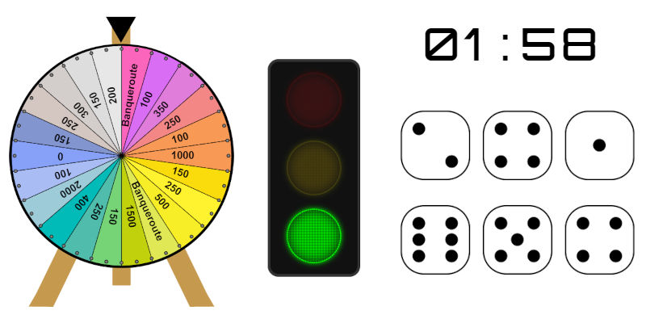

<!--
NOTA: Este README foi creado automáticamente por <https://github.com/YunoHost/apps/tree/master/tools/readme_generator>
NON debe editarse manualmente.
-->

# Digitools para YunoHost

[](https://ci-apps.yunohost.org/ci/apps/digitools/)  

[](https://install-app.yunohost.org/?app=digitools)

*[Le este README en outros idiomas.](./ALL_README.md)*

> *Este paquete permíteche instalar Digitools de xeito rápido e doado nun servidor YunoHost.*  
> *Se non usas YunoHost, le a [documentación](https://yunohost.org/install) para saber como instalalo.*

## Vista xeral

Simple and useful tools for the classroom

**Versión proporcionada:** 0.5.0~ynh2

**Demo:** <https://ladigitale.dev/digitools/>

## Capturas de pantalla



## Documentación e recursos

- Web oficial da app: <https://ladigitale.dev/>
- Documentación oficial para usuarias: <https://ladigitale.dev/blog/digitools-des-outils-simples-et-utiles-pour-la-classe>
- Documentación oficial para admin: <https://codeberg.org/ladigitale/digitools/src/branch/main/README.md>
- Repositorio de orixe do código: <https://codeberg.org/ladigitale/digitools>
- Tenda YunoHost: <https://apps.yunohost.org/app/digitools>
- Informar dun problema: <https://github.com/YunoHost-Apps/digitools_ynh/issues>

## Info de desenvolvemento

Envía a túa colaboración á [rama `testing`](https://github.com/YunoHost-Apps/digitools_ynh/tree/testing).

Para probar a rama `testing`, procede deste xeito:

```bash
sudo yunohost app install https://github.com/YunoHost-Apps/digitools_ynh/tree/testing --debug
ou
sudo yunohost app upgrade digitools -u https://github.com/YunoHost-Apps/digitools_ynh/tree/testing --debug
```

**Máis info sobre o empaquetado da app:** <https://yunohost.org/packaging_apps>
